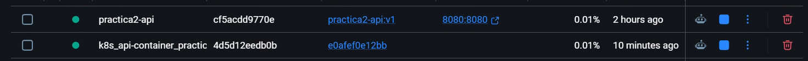
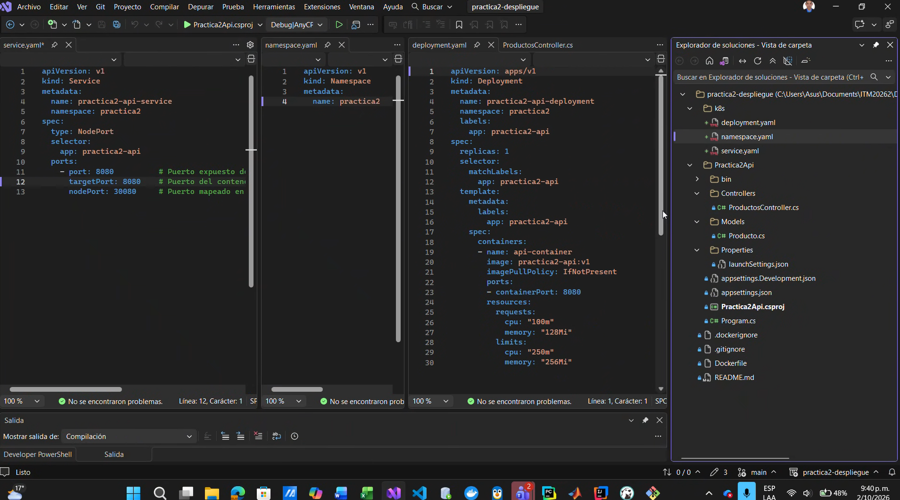
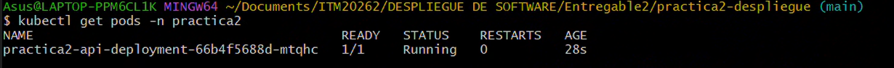
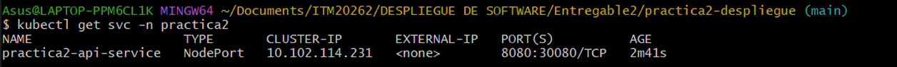
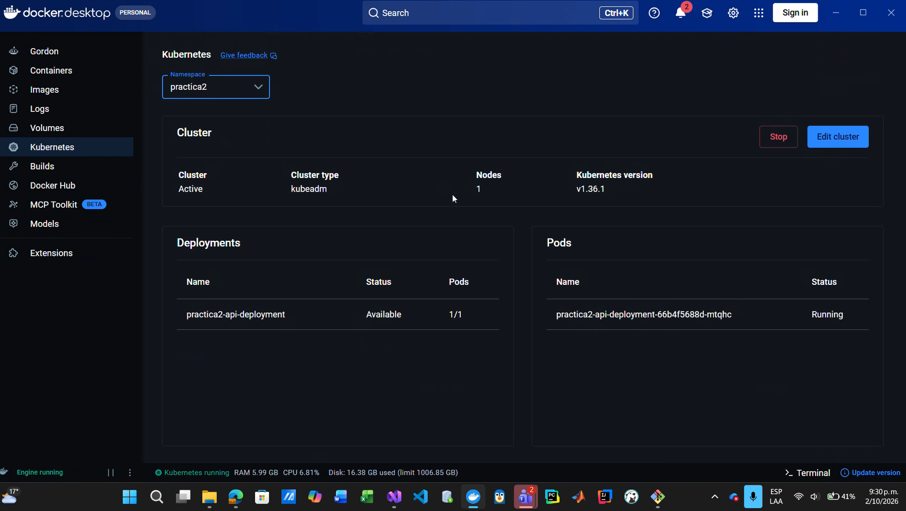
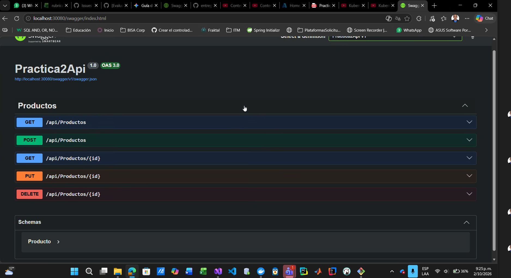

# Práctica 2 · Despliegue de Software

O sea, básicamente en esta práctica construimos una **API REST de productos** en .NET 10, la metimos en un contenedor con **Docker** y luego, tipo, la desplegamos todita en un cluster local de **Kubernetes (K8s)**.

---

## Integrantes

- Daniel Zapata Ramírez
- María Paulina Vargas Lenis
- Mariana Suaza Serna
- Leonel Antonio Martínez Silgado
- Sebastián Ciro Medellín 

---

## Tecnología utilizada

Bueno, digamos que las tecnologías que usamos para armar todo esto fueron:

- **.NET 10 (ASP.NET Core Web API):** O sea, la API base estructurada con controladores.
- **Swagger (Swashbuckle):** Para probar los endpoints interactiva y fácilmente desde el navegador.
- **Docker Desktop:** Para armar la imagen del proyecto usando *build multietapa* (tipo para que no quede pesada).
- **Kubernetes (K8s):** Para orquestar y desplegar el contenedor en un entorno local usando manifiestos YAML.
- **Datos en memoria:** Nada de bases de datos complejas por ahora, todo vive en memoria local.

---

## Estructura del repositorio

Tipo, la estructura del proyecto nos quedó ordenada así:

- `Practica2Api/`: Código fuente de la API en C#.
- `Dockerfile`: Las instrucciones para construir la imagen de Docker.
- `.dockerignore`: Para no meter archivos innecesarios en la imagen.
- `k8s/`: Carpeta con los manifiestos YAML para Kubernetes (`namespace.yaml`, `deployment.yaml`, `service.yaml`).
- `evidencias/`: Capturas de pantalla comprobando que todo sí funcionó.

---

## Endpoints de la API

O sea, los endpoints que tiene la API para gestionar los productos son:

- `GET /api/productos` -> Lista todos los productos.
- `GET /api/productos/{id}` -> Busca un producto específico por ID.
- `POST /api/productos` -> Crea un nuevo producto.
- `PUT /api/productos/{id}` -> Actualiza un producto existente.
- `DELETE /api/productos/{id}` -> Elimina un producto.

---

## Parte 1 · Ejecución con Docker

Bueno, para correr la API de forma individual en Docker, abres la terminal en la raíz del repo y tiras estos comandos, tipo así:

```bash
# 1. Construir la imagen de Docker
docker build -t practica2-api:v1 .

# 2. Ver que la imagen sí haya quedado guardada
docker images

# 3. Poner a correr el contenedor mapeando el puerto 8080
docker run -d -p 8080:8080 --name practica2-api practica2-api:v1

# 4. Confirmar que el contenedor esté vivito y corriendo
docker ps
```

Puertos: O sea, el puerto `8080` de tu PC se conecta directo al puerto `8080` del contenedor.

Para verificar, abres el navegador en `http://localhost:8080/swagger` y listo.

Ejemplo de JSON para enviar en el `POST /api/Productos`:

```json
{
  "id": 5,
  "nombre": "Pantalla",
  "precio": 500000,
  "stock": 10
}
```

### Evidencia de Docker Desktop

Aquí se ve tipo el contenedor de la API corriendo bien en Docker Desktop:



---

## Parte 2 · Despliegue en Kubernetes (K8s)

Bueno, aquí viene la parte interesante. O sea, para el paso 2 ya no corremos el contenedor suelto en Docker, sino que se lo entregamos a **Kubernetes** para que él se encargue de administrarlo.

### 1. Estructura de los Manifiestos (YAML)

Eh, dentro de la carpeta `k8s/` creamos tres archivos YAML esenciales:

- `namespace.yaml`: Tipo para crear un espacio aislado llamado `practica2` y no revolver nada con el resto del cluster.
- `deployment.yaml`: Define el Pod con nuestra imagen `practica2-api:v1`, configurándole recursos de CPU y memoria (1 réplica).
- `service.yaml`: Crea un servicio tipo `NodePort` para exponer la API hacia afuera en el puerto local `30080`.

Así se ven los archivos listos en el editor:



---

### 2. Comandos para aplicar la configuración en K8s

O sea, para desplegar todo en Kubernetes, ejecutas estos comandos en la terminal:

```bash
# Crear el namespace
kubectl apply -f k8s/namespace.yaml

# Crear el Deployment (el Pod con la API)
kubectl apply -f k8s/deployment.yaml

# Crear el Servicio para acceder desde afuera
kubectl apply -f k8s/service.yaml
```

*O si quieres tirar todo de una:* `kubectl apply -f k8s/`

---

### 3. Verificación del despliegue en K8s

Nada, para revisar que todo esté funcionando al 100%, tiramos estos comandos de comprobación:

#### a) Verificar los Pods
Ejecutas `kubectl get pods -n practica2` y te debe mostrar el pod en estado `Running`:



#### b) Verificar el Servicio
Ejecutas `kubectl get svc -n practica2` para comprobar que el puerto `8080` de la API esté mapeado al `30080` de tu máquina:



#### c) Vista desde Docker Desktop (Sección Kubernetes)
O sea, si entras a la pestaña de Kubernetes en Docker Desktop, seleccionas el namespace `practica2` y puedes ver cómo el Deployment y el Pod están activos:



---

### 4. Prueba final en el navegador (Swagger en K8s)

Bueno, ya con el servicio `NodePort` levantado en el puerto `30080`, solo es abrir el navegador e ir a:

`http://localhost:30080/swagger/index.html`

Y listo, como ven en la imagen, ya la API está respondiendo perfectamente dentro del cluster de Kubernetes:



---


## Reflexión técnica

### ¿Cómo abordamos el proceso de despliegue?

Lo hicimos de forma incremental, en el orden que plantea la práctica: **API → Docker → Kubernetes**. Primero construimos una API REST de productos en **.NET 10** (ASP.NET Core Web API con controladores) con datos en memoria. Así nos podíamos concentrar en el despliegue y no en la persistencia. Antes de contenerizarla verificamos los cinco endpoints CRUD con Swagger. Después escribimos el `Dockerfile`, construimos la imagen `practica2-api:v1` y la ejecutamos con `docker run -p 8080:8080` para validar que respondía en `localhost:8080/swagger`. Cuando confirmamos que la imagen funcionaba, la reutilizamos en el clúster local de Kubernetes de Docker Desktop. Para eso creamos tres manifiestos separados (`namespace.yaml`, `deployment.yaml` y `service.yaml`) y los aplicamos con `kubectl apply`. Por último, comprobamos el resultado con `kubectl get pods` y `kubectl get svc` en el namespace `practica2` y probamos la API desde Swagger en el puerto `30080`.

### ¿Qué errores encontramos y cómo los resolvimos?

- **Swagger no cargaba dentro del contenedor:** ASP.NET Core solo lo habilita en el entorno *Development*, y el contenedor corre en *Production*. Lo resolvimos ajustando la configuración en `Program.cs` para que Swagger quedara disponible.
- **El pod intentaba descargar la imagen desde Docker Hub:** esa imagen solo existía localmente. Lo corregimos con `imagePullPolicy: IfNotPresent` para que el clúster usara la imagen ya construida.
- **Indentación de los YAML y *labels/selectors*:** si los *labels* del Deployment no coinciden con el *selector* del Service, el Service no encuentra el pod. Los revisamos con `kubectl describe` hasta que todo quedó con `app: practica2-api`.
- **Conflicto de puertos:** como el contenedor de la Parte 1 seguía ocupando el puerto `8080`, expusimos el Service con un **NodePort** distinto (`30080`) para que las dos pruebas pudieran convivir.

### ¿Cómo se distribuyeron las responsabilidades del equipo?

Nos repartimos el trabajo por frentes. Una parte del equipo desarrolló la API y el modelo `Producto`. Otra se encargó del `Dockerfile` y del `.dockerignore`. Otros integrantes escribieron y validaron los manifiestos de Kubernetes, y el resto preparó el README, las evidencias y el video. Todo lo integramos en un repositorio común de GitHub, y en el video cada integrante explicó la parte que trabajó.

### ¿Qué decisiones de la tecnología influyeron en el Dockerfile y en el despliegue?

- **Build multietapa:** la primera etapa usa la imagen del **SDK de .NET** para restaurar dependencias, compilar y publicar, y la segunda usa solo el **runtime de ASP.NET**. Así la imagen final es mucho más liviana y no incluye el compilador ni el código fuente.
- **Puerto 8080:** es el que .NET expone por defecto en contenedores desde la versión 8. Por eso usamos ese mismo valor en el `docker run`, en el `containerPort` y en el `targetPort` del Service.
- **Una sola réplica:** como la API guarda los datos en memoria, con varias réplicas cada pod tendría datos distintos.
- **Requests y limits:** definimos `100m/128Mi` y `250m/256Mi` de CPU y memoria, suficientes para una API liviana.
- **Imagen versionada:** usamos la etiqueta `v1` para tener despliegues trazables.


## Video Demostrativo

Nada, en este enlace pueden ver el video donde explicamos todo el paso a paso del despliegue:

- [Pendiente: Enlace al video de YouTube]
